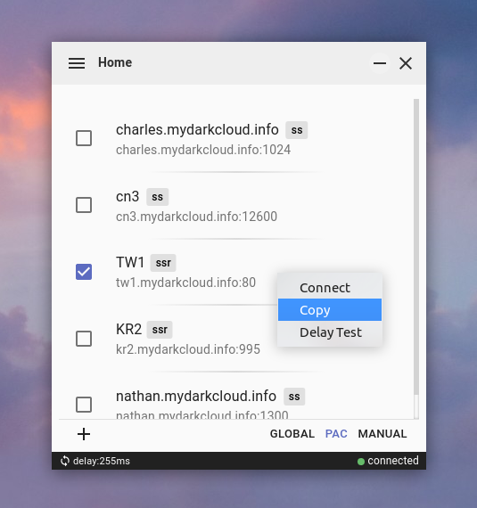
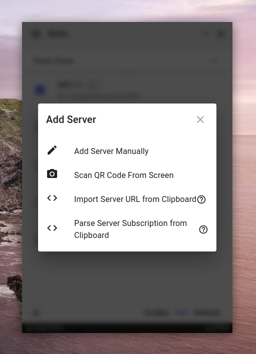
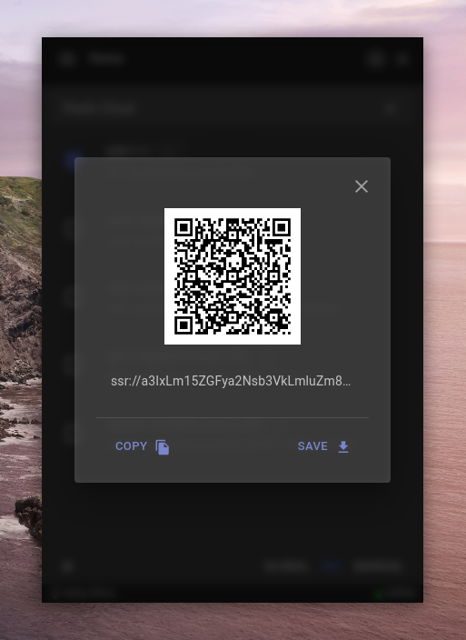
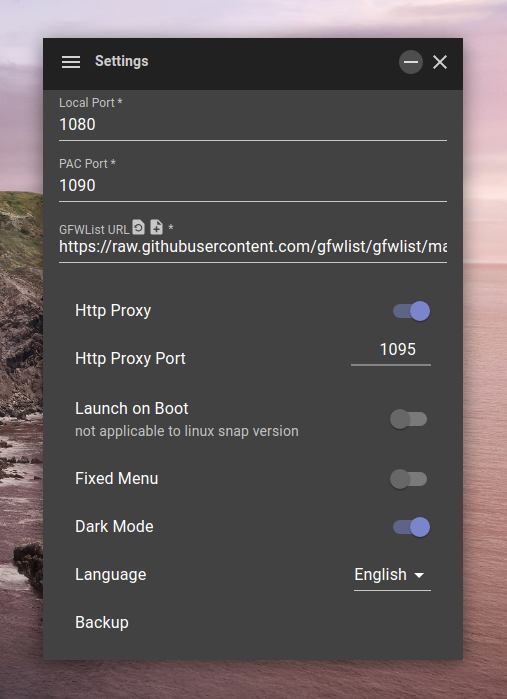

# Shadowsocks Electron

> Test on Ubuntu20.4.3 (amd64) and MacOS catalina (x64)

Shadowsocks GUI application with cross-platform desktop support based on Electron⚛️, made specially for Linux/Mac users.

## Screenshots











## Downloads

- GitHub Releases

  [download](https://github.com/nojsja/shadowsocks-electron/releases/latest)

## Why?

- The official qt-version app - [`shadowsocks-qt5`](https://github.com/shadowsocks/shadowsocks-qt5) has been deprecated, which has an old interface but still working.
- Only [`Shadowsocks-libev`](https://github.com/shadowsocks/shadowsocks-libev) and [`Shadowsocks for Android`](https://github.com/shadowsocks/shadowsocks-android) support ACL (bypass China IPs, etc.)

 This project was heavily inspired by [shadowsocks/ShadowsocksX-NG](https://github.com/shadowsocks/ShadowsocksX-NG), which uses local Shadowsocks-libev binary to avoid complex integration with native C code. This means it can always use the latest Shadowsocks-libev version.

It also uses Electron to bring the most powerful cross-platform desktop support with great developing experience.

## Features

> ➣ Supported

- __SS / SSR__ Protocol
- __PAC__ Mode (GFWList)
- __Global__ Mode (socks proxy)
- __Manual__ Mode (no system-wide proxy set)
- HTTP(s) Proxy
- Clipboard / QR-code Import
- Language Detecting / Switching (zh-CN / en-US)
- Configuration Backup / Recovery
- Auto Start
- Server Share
- Logs

> ➣ In Testing

- AEAD ciphers
- SIP003 plugins (v2ray & kcptun)

> ➣ Comming Soon

- ACL
- VMess Protocol (v2ray)

## Development

### 1. env

- Node@^`14.18`
- Ubuntu18.04 or higher version
- Mac catalina or other versions (works in most recent versions in theory)

### 2. Prepare

> The step is not necessary, there are some buildin `ssr/ss` executable files provided in bin dir, Only do this when you want to use external bin for test/dev.

- __Mac__ developers need to install `shadowsocks-libev` at first, use command here: `brew install shadowsocks-libev`. For china users, if brew is not installed, run this in terminal: `/bin/zsh -c "$(curl -fsSL https://gitee.com/cunkai/HomebrewCN/raw/master/Homebrew.sh)"` to install brew.
- __Ubuntu__ developers can install `shadowsocks-libev` with apt manager.

```bash
# for ubuntu developers
$: sudo apt install shadowsocks-libev
# for mac developers
$: brew install shadowsocks-libev
```

### 3. Run commands in terminal

```bash
# [01]clone
$: git clone https://github.com/nojsja/shadowsocks-electron.git
$: cd shadowsocks-electron

# for china developers
$: npm config set electron_custom_dir "13.4.0"
$: npm config set electron_mirror http://npm.taobao.org/mirrors/electron/

# [02]npm
$: npm i -g yarn
$: npm i

# [03]run scripts/download.js for env prepare
$: cd scripts
$: node download.js

# for ubuntu developers
$: cp pac/gfwlist.txt ~/.config/shadowsocks-electron/pac/
# for mac developers
$: cp pac/gfwlist.txt ~/Library/Application\ Support/shadowsocks-electron/pac/

# [04]start
$: npm start
```

## Supported Platforms & Arch

> More architecture will be supported if necessary, just give me an issue. Forget about windows (x32/x64), there are tons of apps on it already.

- Ubuntu (linux x64)
- MacOS (darwin x64)
- <del>Windows (windows x64)</del>

## Mention

> The repo is cloned from `robertying/shadowsocks-electron` which is no longer maintained. I create a new repo based on that in order to be found in github search list.

## Credit

- [tindy2013/shadowsocks-static-binaries](https://github.com/tindy2013/shadowsocks-static-binaries)
- [robertying/shadowsocks-electron](https://github.com/robertying/shadowsocks-electron)
- [shadowsocks/shadowsocks-libev](https://github.com/shadowsocks/shadowsocks-libev)
- [shadowsocks/ShadowsocksX-NG](https://github.com/shadowsocks/ShadowsocksX-NG)
